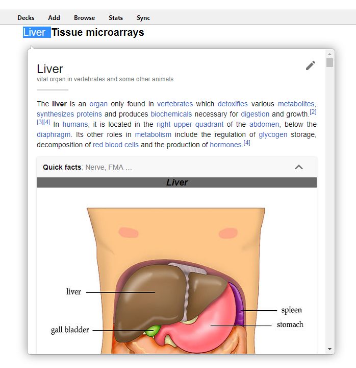
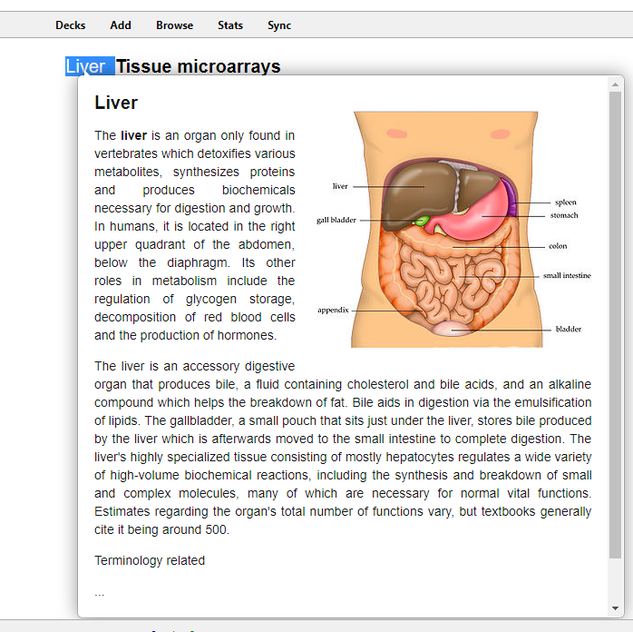

# AnkiWikiPopup
Anki 2.1 addon to display Wikipedia page previews inside of [Anki](https://apps.ankiweb.net/).

Shows a popup of the Mobile Wikipedia page / Extract for the selected text. In order to avoid conflicts with the Popup-Dictionary addon, this addon only supports keyboard shortcuts (Control-Shift-W) for now. 

#### Mode:
| Mobile (default)             |  Extract (shorter, faster to load) |
:-------------------------:|:-------------------------:
  |  

### Features

- Popup of either full mobile pages, or shorter extracts
- page caching to speed up repeated searches
- Multilanguage support - change the language in `config.json` with the language [as per list here](https://en.wikipedia.org/wiki/List_of_Wikipedias#List).

This addon currently in beta stage - things will almost certainly break! Please submit a bug report if it does.

### Installation

#### AnkiWeb

The easiest way to install Pop-up Dictionary is through [AnkiWeb](https://ankiweb.net/shared/info/395343016).

#### Manual installation

1. Make sure you have the [latest version](https://apps.ankiweb.net/#download) of Anki 2.1 installed. Earlier releases (e.g. found in various Linux distros) do not support `.ankiaddon` packages.
2. Download the latest `.ankiaddon` package from the [releases tab](https://github.com/cfculhane/AnkiPopupWikipedia/releases) (you might need to click on *Assets* below the description to reveal the download links)
3. From Anki's main window, head to *Tools* → *Add-ons*
4. Drag-and-drop the `.ankiaddon` package onto the add-ons list
5. Restart Anki

### License and Credits

Significant portions of the code (as marked in the source files)
 were based on the Anki add-on [Pop-up Dictionary](https://github.com/glutanimate/popup-dictionary/) by Glutanimate. [Click here to support Glutanimate's work](https://glutanimate.com/support-my-work/).

I would also like to thank the team at [AMBOSS](https://www.amboss.com/) for their encouragment and insipration for this work. Some css and js code was taken from their [extremely good Anki Addon](https://www.amboss.com/us/anki-amboss?hp=header).

Ships with the following javascript libraries:
- jQuery (v1.12.4), (c) jQuery Foundation, licensed under the MIT license
- qTip2 (v3.0.3), (c) 2011-2018 Craig Michael Thompson, licensed under the MIT license
- imagesLoaded (v4.1.4) (c) David DeSandro, licensed under the MIT license

PopupWikipedia is free and open-source software. The add-on code that runs within Anki is released under the GNU AGPLv3 license. For more information please see the [LICENSE](https://github.com/cfculhane/AnkiPopupWikipedia/blob/master/LICENSE) file that accompanied this program.

This program is distributed in the hope that it will be useful, but WITHOUT ANY WARRANTY.

### Known issues

- Clicking on links inside the popup opens the browser, *but with the wrong URL*
- Disambiguation pages are not handled well
- Does not work with NightMode due to the way Night-Mode monkeypatches Reviewer.revHtml, see [this github issue here](https://github.com/krassowski/Anki-Night-Mode/issues/53)
- Currently does not play nicely with Popup Dictionary. Currently trying to figure this out!

